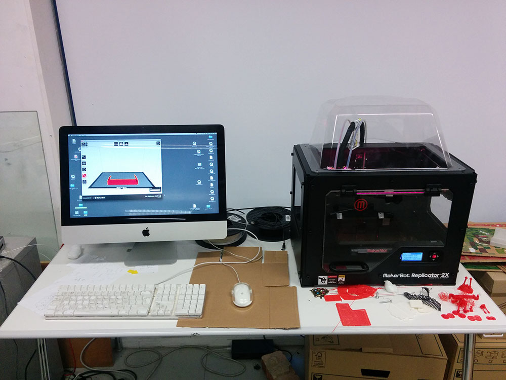
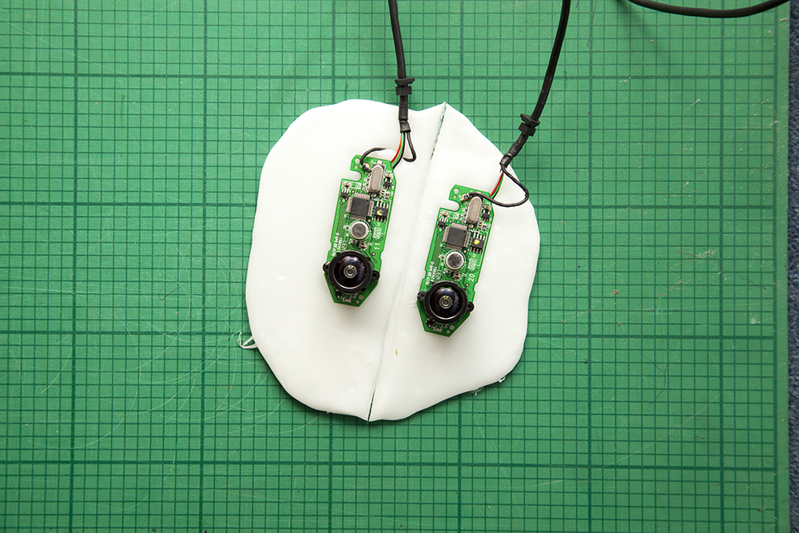

So as i said in my first post,  I've copied the rig setup developed by Will Steptoe[AR-Rift](http://willsteptoe.com/post/66968953089/ar-rift-part-1)). Who has been an incredibly useful resource for my project and very kind in sending me the .stl files that he created for the rig. Which I then 3D printed myself.

I then took two logitec c310 webcams and ripped them apart, I also took two WideCam F100 and ripped the lenses off them and superglued them to the boards of the c310's. 

I then set the camera boards in thermoplastic and let it set. 

I then got to work on cutting them down to size (sawing plastic with a low melting point turns out to be a nightmare btw).

After a couple of hours and some sore arms. It was about time to test the whole rig out properly with the rift, and guess what.... the webcams werent recognised. Spent a couple of hours trying to diagnose a problem with the software and in the end decided to rip the board off the plastic and saw this.

I had managed to rip a resistor and the ribbon cable attachment of the bottom of the circuit board as I was sawing it. 

So what I've learned is that you shouldn't set a double sided PCB into thermoplastic and then saw it with a hacksaw.. Time to buy more camera's.
