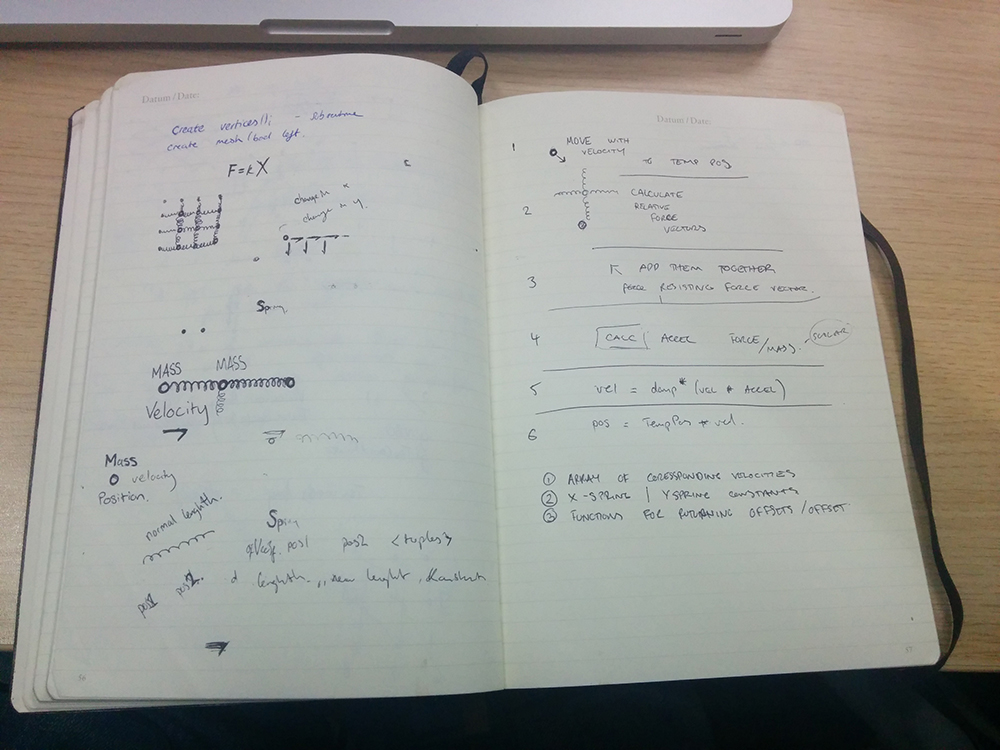

So instead of diving straight into the pit of no return that is developing my own uber-sophisticated shape detection and tracking algorithms, I decided to side track a bit and try doing some fun things with texture mapping on to a mesh a physics! 

My idea was to have each vertex on the mesh (to which the video feed is mapped onto) be connected to each other vertex next to it by springs. Seemingly simple enough, but still became a bit of a headache to do in the end (until I got it to work of course). I wanted to avoid using a library like Box2d, so I could have full control over what was going on. I've pretty quickly come to the realisation that libraries aren't as instantly and magically useful as I had presumed, and are actually quite clunky and annoying. 

Anyway, I started off doing to a bit manual think, and dusting off some old A-Level physics books, and trying to figure out how I would translate this into a mesh of hundreds of springs being updated. 

I had thought I had figured it out but still needed to test out my hypothesis. I made a processing sketch to test it out before I jumped straight into the far less forgiving world of c++. Surprisingly I got it too work pretty quickly.

https://www.youtube.com/watch?v=FpnJLLciJkY

Confident that I had a reasonably accurate simulation of a springs behaviour, I implemented it in a modified version of the wonderland blob detection code. And this is what I got.

https://www.youtube.com/watch?v=-S8ULznmxOc

All working surprisingly well, now for the money shot!

https://www.youtube.com/watch?v=TvpKUIxnjrY

And with more springs. (A little slow as I'm screen recording).

https://www.youtube.com/watch?v=_uVZpjfzhlw

All in all I'm very happy with the rate of progress I've been making in the past week :)

##Link to prototype

[The code for this is on github](https://github.com/terrybroad/Spring-Mesh-Webcam)

##TO DO:

Re-make the spring simulation as a vertex shader, I think some lightning fast GPU parallel processing couldn't hurt.

Have the motion of the springs controlled by motion detection. 

Have the motion of the springs controlled by audio. 
