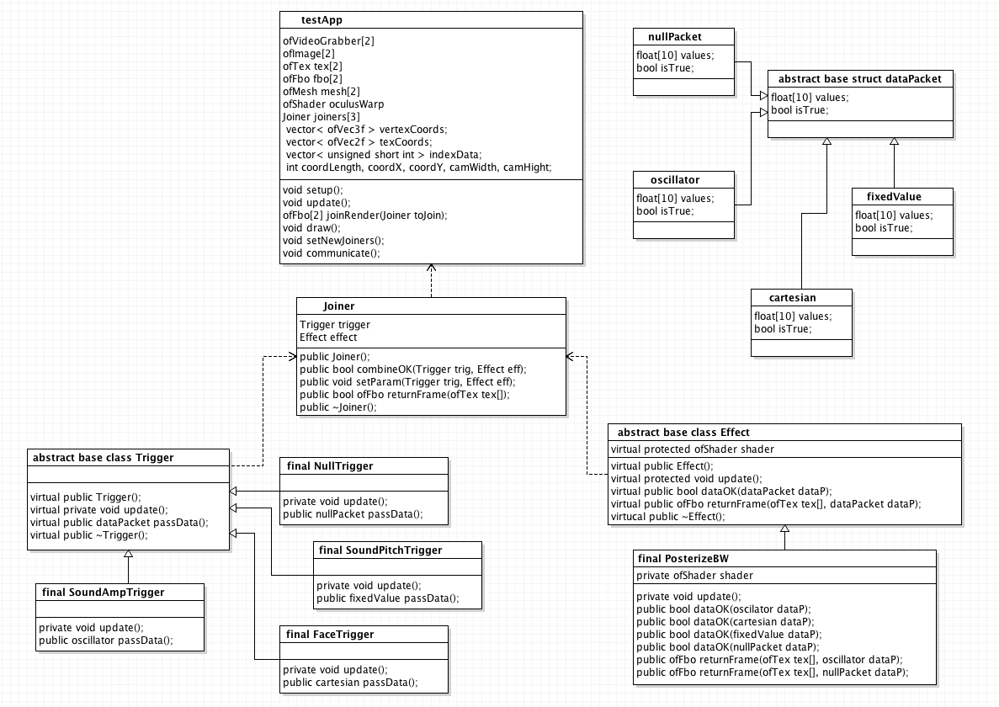
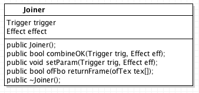
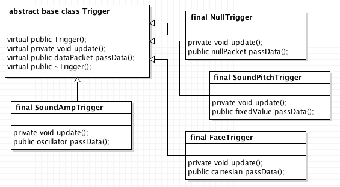
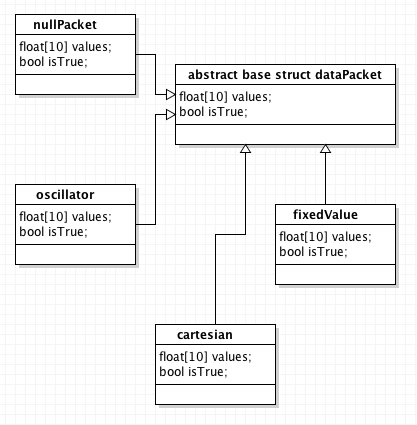
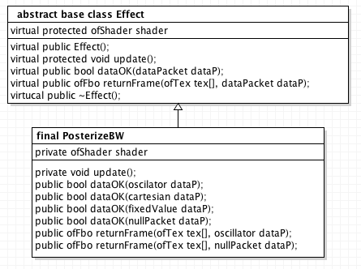

So i’ve had my fun with shaders and music for the time being, its time to turning my hand to planning the class structure of the software rendering the effects. Its been quite difficult figuring out how the code could be designed in a way that is as modular, flexible and effectively implements the ability for anyone to combine triggers and effects in a vast array of permutations without things breaking, or completely messing up. 

I’ve come to a preliminary solution on how this may be implemented, mocking it up using UML class diagrams. I’m still not completely familiar with class structures in C++ so some of this may be a bit wrong, but this is just a working mockup of the broad outline of the class structure. 

An important structural element would be a Joiner class that contains and passes data between a trigger class and an effect class. Each frame it would return an array of 2 frame buffer objects, which would then either be passed on to the next joiner as an array of 2 textures or drawn to the screen if there was not another joiner pass a texture onto. 

The trigger classes function is to analyze data from a variety of possible sources (ambient sounds, accelerometer data, image input, etc), extract useful features and then represent these as easily computable parameters to be passed to the effect class. 

The data parameters would be represent in a simple struct that would contain the variables types needed for all the different kinds of data represented by the different triggers. The important part here is that I will be using polymorphism to implicitly define what kind of data is represented in the dataPacket object, and how it should (if it can be at all) dealt with by the effect class. So the different triggers (which inherit from the abstract Trigger class) return different kinds of data packets (which inherit from the abstract dataPacket struct). For instance a face tracking trigger would return the cartesian coordinates for where faces are in the scene. Whereas a trigger detecting the amplitude of sound would be returning numbers that are constantly oscillating between 0 and 1. These of course would need to be handled very differently by the effect class. 

So the effect class will then implicitly run different implementations of the effect depending on what type of data it is receiving. Each effect would have a function which returns a boolean telling the joiner if it can or can not accept that data packet type. In the eventuality that it couldn’t, the joiner would then either pair the effect with a nullTrigger, or just pass the frame buffer object directly onto the next joiner without rendering any effect. (However this precaution should in theory never need to be called, as long as the web portal prevents someone from pairing up incompatible joiners and triggers). 

The effect class would contain at least one shader, and return an array of 2 frame buffer objects (one for each eye) to be passed directly to the joiner class. I have just shown one effect class in this diagram but there would obviously be many of them in the final implementation. 
