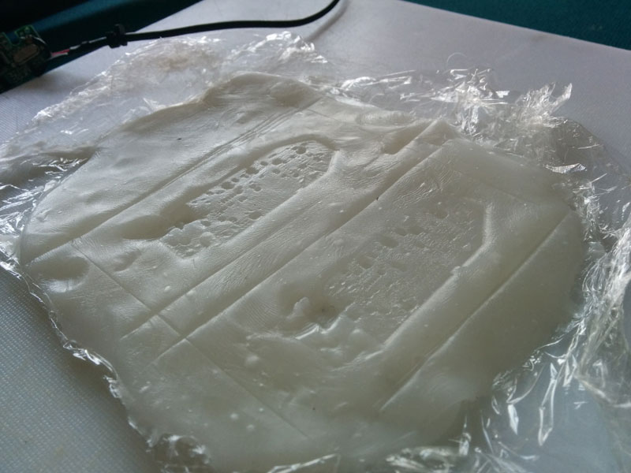

I've finally rebuilt the camera rig for my prototype, and this time I've managed to not destroy anything! 
Everything works and I've also calibrated the shaders to work properly and it all looks amazing, great to finally get it all up and running. I will have another post up tomorrow about getting it all calibrated and some videos of it in use, just need to do a bit of video editing first.

Here's the webcam's.

Sawing them apart.

The senses that originaly came with the logitec C310 cameras.

Taking the lenses off.

Gluing the new lenses from the Genius Widecam F100 on. 

Testing them.

Indenting them into thermoplastic.

Cutting and drilling.

Accidentaly drilled some holes into our salvaged pool table. 

And the final prototype in all its glory, certainly not the best looking thing but it certainly does the job!

