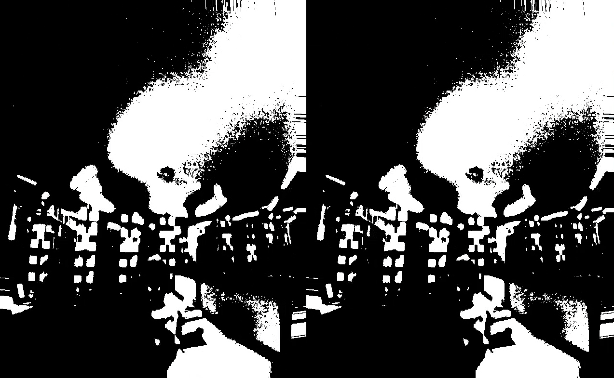

# Mediated Perception

## Terence Broad
- [www.terencebroad.com](http://www.terencebroad.com)
- [GitHub Account](https://github.com/terrybroad "GitHub Account")

## Description
'Mediated Perceptions' is an experimental inquiry into the possibilities facilitated by having a fully governable prosthetic layer that alters the perceptual field of the outside world. A stereoscopic camera rig will be built and attached to the Oculus Rift along with headphones and a microphone rig, which will extend the field of auditory and visual perception.

An experience similar to that of synaesthesia will be created by exploring the strong positive relationship between synchronised audio and visual experience. In order to achieve this, experimental image and audio analysis techniques will be used to control audio and visual filtering techniques.

The plan would be that in a gallery context, the video and audio output would streamed live to google hangouts, so there would be a channel where anyone from around the world could tune in and see what was been seen at the present moment by the viewer in the gallery space. 

## Link to Prototype

[Initial Prototype](https://github.com/terrybroad/oculus-mediated-vision-prototype-1)

[Blob Morph Prototype](https://github.com/terrybroad/wonderland_webcam)

[Spring Mesh Webcam Prototype](https://github.com/terrybroad/Spring-Mesh-Webcam"Initial Prototype)


## Example Code
NOTE: Wrap your code blocks or any code citation by using ``` like the example below.
```
         GL_LINEAR;
         GL_LINEAR_MIPMAP_LINEAR;
         framebuffer.begin();
         tex[0].bind();
         mesh.draw();
         tex[0].unbind();
         framebuffer.end();
        
         hmdWarpShader.begin();
         hmdWarpShader.setUniformTexture("tex", framebuffer.getTextureReference(), 0);
         hmdWarpShader.setUniform2f("LensCenter", _x + (0+ DistortionXCenterOffset * 0.5f)*0.5f, _y + _h*0.5f );
         hmdWarpShader.setUniform2f("ScreenCenter", _x + _w*1.0f, _y + _h*1.0f );
         hmdWarpShader.setUniform2f("Scale", (_w/1.0f) * 1.0f, (_h/1.0f) * 1.0f * as );
         hmdWarpShader.setUniform2f("ScaleIn", (1.0f/_w), (1.0f/_h) / as );
         hmdWarpShader.setUniform4f("HmdWarpParam", K0, K1, K2, K3 );

         ofPushMatrix();
         ofTranslate(0,0);
         framebuffer.draw(0, 0);
         ofPopMatrix();
         hmdWarpShader.end();
         tex[0].unbind();
```
## Links to External Libraries
 
[openFrameworks](https://github.com/openframeworks/openFrameworks "openFramworks") <br>
[openCV](https://github.com/Itseez/opencv "OpenCV") <br>
[Maximillian](https://github.com/micknoise/Maximilian "Maximillian") <br>
[Google C++ API](https://github.com/google/google-api-cpp-client "https://github.com/google/google-api-cpp-client") <br>
[Wekinator](https://code.google.com/p/wekinator/ "Wekinator") <br>
[OSC](http://opensoundcontrol.org/ "OSC") <br>

## Images & Videos
https://www.youtube.com/watch?v=1BbDZTKxXGQ&feature=youtu.be
https://www.youtube.com/watch?v=_uVZpjfzhlw

