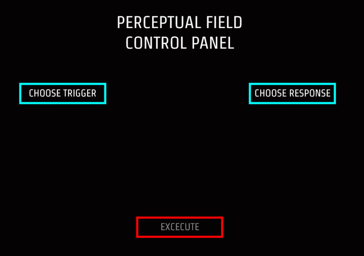

# Mediated Perceptions

## Terence Broad
- [www.terencebroad.com](http://www.terencebroad.com)
- [GitHub Account](https://github.com/terrybroad "GitHub Account")

## Description
'Mediated Perceptions' is an experimental inquiry into the possibilities facilitated by having a fully governable prosthetic layer that alters the perceptual field of the outside world. A stereoscopic camera rig will be built and attached to the Oculus Rift along with headphones and a microphone rig, which will extend the field of auditory and visual perception.

Using the Google hangouts API, people online will be able to choose and link up sets of triggers and responses that control the perceptual experience for the user in the gallery. The video and audio feed will then be livestreamed online, so anyone will be able watch what is being percieved by the viewer in the gallery at that exact time. Everytime a new experience is submitted online it will be added to a queue, and a new one will be excecuted everytime a new viewer tries on the headset in the gallery. 

The triggers will be things like motion detection, face detection, head movement, pitch, loudness and brightness. Responses will be all sorts of different methods of image manipulation like colour shifting, wobble and morphing effects, blurring, chromatic abberation and temporal layering. 

## Link to Prototype

[Initial Prototype](https://github.com/terrybroad/oculus-mediated-vision-prototype-1)

[Blob Morph Prototype](https://github.com/terrybroad/wonderland_webcam)

[Spring Mesh Webcam Prototype](https://github.com/terrybroad/Spring-Mesh-Webcam"Initial Prototype)

[Music Re-Visualiser Prototype](https://github.com/terrybroad/Music_Re-Visualiser)

## Example Code
NOTE: Wrap your code blocks or any code citation by using ``` like the example below.
```
         GL_LINEAR;
         GL_LINEAR_MIPMAP_LINEAR;
         framebuffer.begin();
         tex[0].bind();
         mesh.draw();
         tex[0].unbind();
         framebuffer.end();
        
         hmdWarpShader.begin();
         hmdWarpShader.setUniformTexture("tex", framebuffer.getTextureReference(), 0);
         hmdWarpShader.setUniform2f("LensCenter", _x + (0+ DistortionXCenterOffset * 0.5f)*0.5f, _y + _h*0.5f );
         hmdWarpShader.setUniform2f("ScreenCenter", _x + _w*1.0f, _y + _h*1.0f );
         hmdWarpShader.setUniform2f("Scale", (_w/1.0f) * 1.0f, (_h/1.0f) * 1.0f * as );
         hmdWarpShader.setUniform2f("ScaleIn", (1.0f/_w), (1.0f/_h) / as );
         hmdWarpShader.setUniform4f("HmdWarpParam", K0, K1, K2, K3 );

         ofPushMatrix();
         ofTranslate(0,0);
         framebuffer.draw(0, 0);
         ofPopMatrix();
         hmdWarpShader.end();
         tex[0].unbind();
```
## Links to External Libraries
 
[openFrameworks](https://github.com/openframeworks/openFrameworks "openFramworks") <br>
[openCV](https://github.com/Itseez/opencv "OpenCV") <br>
[Maximillian](https://github.com/micknoise/Maximilian "Maximillian") <br>
[Google C++ API](https://github.com/google/google-api-cpp-client "https://github.com/google/google-api-cpp-client") <br>
[Wekinator](https://code.google.com/p/wekinator/ "Wekinator") <br>
[OSC](http://opensoundcontrol.org/ "OSC") <br>

## Images & Videos

http://www.youtube.com/watch?v=N-EsaaBtW4s
https://www.youtube.com/watch?v=1BbDZTKxXGQ&feature=youtu.be
https://www.youtube.com/watch?v=_uVZpjfzhlw
